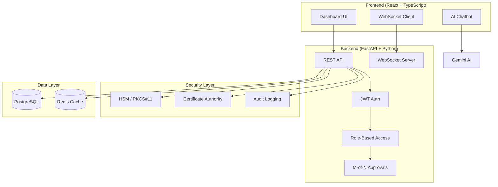

# KT Secure - HSM Code Signing Platform

[](https://github.com/Sharmarajnish/KTSecure_CodeSignIn/actions/workflows/ci.yml)

> **Enterprise-grade HSM-based code signing platform with comprehensive security controls, multi-tenant organization management, and AI-powered assistance.**

---

## About

**KT Secure** is a full-stack enterprise platform designed for secure code signing operations using Hardware Security Modules (HSM). Built with modern technologies and following security best practices, it provides:

- **Complete Key Lifecycle Management** - Generate, store, rotate, and revoke cryptographic keys securely within HSM boundaries
- **Multi-Tenant Architecture** - Hierarchical organization structure with granular role-based access control
- **Compliance-Ready** - Audit logging, M-of-N quorum approvals, and key ceremony workflows for regulatory compliance
- **Developer-Friendly** - RESTful APIs, real-time WebSocket notifications, and AI-powered chatbot for assistance

---

## Architecture



---

## Features

| Category | Features |
|----------|----------|
| 🔐 **Security** | HSM/PKCS#11 integration, JWT auth, RBAC, M-of-N quorum approvals |
| 🏢 **Organizations** | Multi-tenant, hierarchical structure, approval workflows |
| 🔑 **Keys** | RSA/ECDSA generation, rotation, ceremony wizard |
| ✍️ **Signing** | Code signing, firmware signing, timestamp authorities |
| 📜 **Certificates** | CA integration (EJBCA, MSCA), profile management |
| 📊 **Analytics** | Real-time dashboard, activity metrics, key rotation heatmap |
| 🤖 **AI** | Gemini-powered chatbot with markdown responses |
| 🔔 **Real-time** | WebSocket notifications for approvals and events |

---

## Tech Stack

**Frontend:** React 18, TypeScript, Vite, Recharts, Lucide Icons  
**Backend:** FastAPI, SQLAlchemy, Alembic, Pydantic  
**Database:** PostgreSQL, Redis  
**AI:** Google Gemini 2.5 Flash  
**Security:** JWT, bcrypt, PKCS#11  

---

## Quick Start

### Backend

```bash
cd backend
python -m venv .venv && source .venv/bin/activate
pip install -r requirements.txt
alembic upgrade head
uvicorn app.main:app --reload
```

### Frontend

```bash
cd frontend
npm install
echo "VITE_GEMINI_API_KEY=your-key" > .env
npm run dev
```

### Default Admin

- **Email:** admin@ktsecure.io
- **Password:** Admin123!

> ⚠️ Change password after first login!

---

## API Documentation

| Endpoint | Description |
|----------|-------------|
| `http://localhost:8000/docs` | Swagger UI |
| `http://localhost:8000/redoc` | ReDoc |

---

## Project Structure

```
├── backend/
│   ├── app/
│   │   ├── api/          # REST endpoints
│   │   ├── core/         # Security, WebSocket
│   │   ├── models/       # SQLAlchemy models
│   │   └── utils/        # Cycle detection, helpers
│   └── tests/            # pytest test suite
│
├── frontend/
│   ├── src/
│   │   ├── components/   # React components
│   │   └── services/     # API & Gemini clients
│   └── vite.config.ts    # Code splitting config
│
└── docs/                 # API & enterprise docs
```

---

## License

Proprietary - Precogs AI © 2025

Developed & conceptualized by **Rajnish Sharma**
